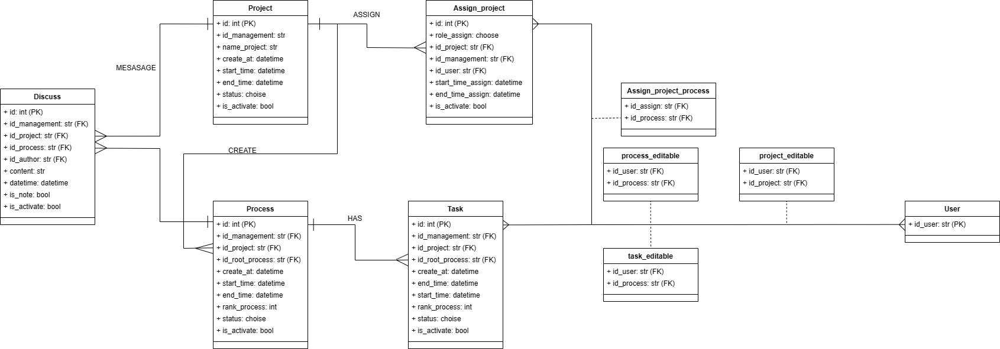

# MCI_intern

# ERD




# RUN PROJECT

## 1. Clone project

```bash
git clone https://github.com/nguyenvanvutlv/MCI_intern.git
cd MCI_intern
pip install -r requirements.txt
```

## 2. Create database [MySQL]


```sql
CREATE DATABASE name_database;
```

```python
DATABASES = {
    'default': {
        'ENGINE': 'django.db.backends.mysql',
        'NAME': 'name_database',
        'HOST': '127.0.0.1',
        'PORT': '3306',
        'USER': 'your_user',
        'PASSWORD' : 'your_password'
    }
}
```

```bash
python manage.py makemigrations
python manage.py migrate
python manage.py createsuperuser
python manage.py runserver
```


# API DOCUMENT

[API](https://www.postman.com/satellite-specialist-59600610/workspace/pat/collection/19512792-1f5c60ad-07e9-4e30-9009-032ae553cf01?action=share&creator=19512792&active-environment=19512792-3c741fb4-6770-48fe-b30c-ec08c11b16e2)
